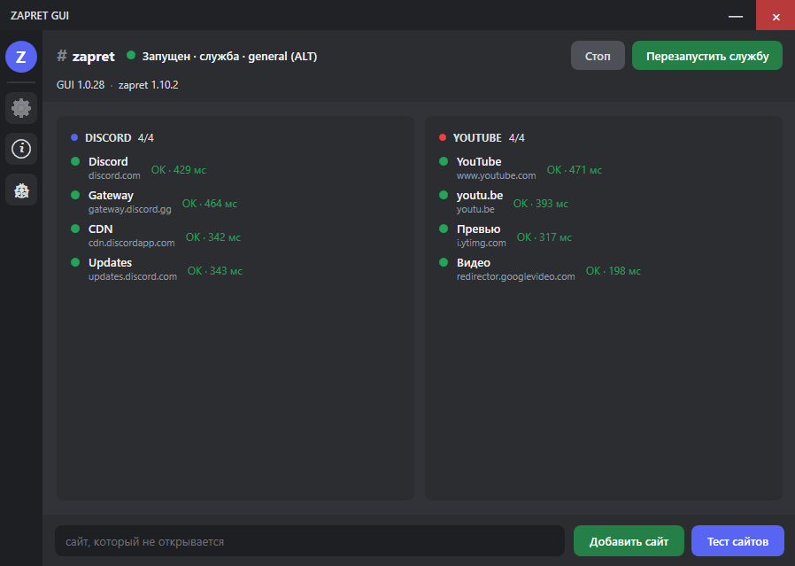
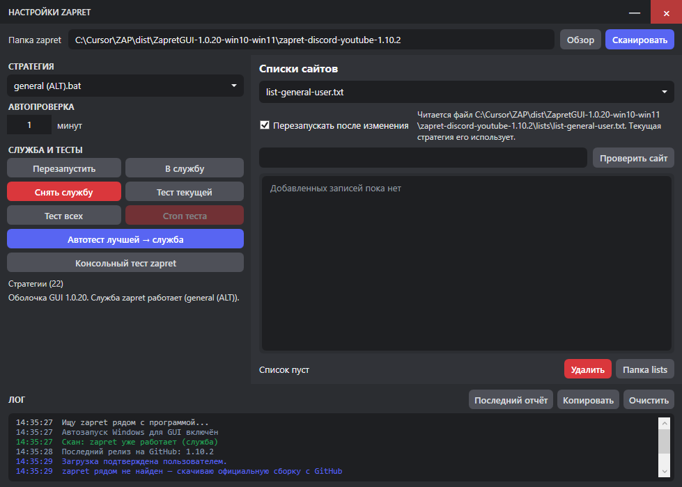

## [Русский](#русский) | [English](#english)

# ZAPRET GUI

[](https://github.com/surensuccessful-ui/zapret-gui/releases/latest)
[](https://github.com/surensuccessful-ui/zapret-gui/releases/latest)
[](LICENSE)
[](https://online620.drweb.com/cache/?i=c64a838b7e8e177de6f4f68301d567cf)
[](https://www.virustotal.com/gui/file/a8046c2ef24cc9b91bec7d1df2425d70872f7376bb31432f00ac4d8a2bc65e09)
[](https://cursor.com)

**Форк оригинального [zapret](https://github.com/bol-van/zapret)** с графической оболочкой для Windows. Движок — сборка [Flowseal zapret-discord-youtube](https://github.com/Flowseal/zapret-discord-youtube).

Проект сделан в [Cursor](https://cursor.com). Python не нужен.

**[Скачать ZapretGUI.exe](https://github.com/surensuccessful-ui/zapret-gui/releases/latest)** · [версии проекта](CHANGELOG.md)

<p>
  
</p>
<p>
  
</p>

---

## Русский

Графическая оболочка для zapret: подключает папку сборки Flowseal, ставит выбранную стратегию службой Windows и показывает, открываются ли Discord и YouTube. Официальные `general*.bat` и `service.bat` программа не меняет.

По умолчанию программа **прописывается в автозапуск Windows**. Кнопка закрытия **сворачивает окно в трей**, обход при этом не останавливается.

### Возможности

- Запуск, стоп и перезапуск службы zapret в один клик
- Живые карточки Discord и YouTube с задержкой
- Автоподбор лучшей стратегии и установка её службой
- Добавление сайтов только в пользовательские списки (`*user*.txt`)
- Тест своих URL разными стратегиями (кнопка «Тест сайтов»)
- Кнопка «О программе»: версия оболочки, дата выпуска, разработчик
- Автопроверка новой версии самой оболочки на GitHub (скачивание с прогрессом и перезапуск)
- Сворачивание в трей (закрытие окна не выключает обход)
- Автозапуск Windows по умолчанию: запись в «Автозагрузке» и задача Планировщика без повторного UAC
- Автопроверка новой сборки zapret на GitHub, пока GUI запущен
- Одна копия программы: вторая не откроется

### Установка

Установка не нужна.

1. Скачайте `ZapretGUI.exe` со страницы [Releases](https://github.com/surensuccessful-ui/zapret-gui/releases/latest).
2. Запустите файл и подтвердите UAC. Без прав администратора службу zapret поставить нельзя.
3. Если Windows покажет SmartScreen: **Подробнее → Выполнить в любом случае**.

Папку zapret программа скачает с GitHub или предложит указать самой. Рядом с EXE ничего класть не обязательно.

### Проверка на вирусы

Отчёт относится **только к конкретному файлу с конкретным SHA-256**. Если EXE пересобран хотя бы на один байт, старый отчёт к нему больше не относится.

Проверена оболочка `ZapretGUI.exe` из [релиза v1.0.20](https://github.com/surensuccessful-ui/zapret-gui/releases/tag/v1.0.20), не `winws.exe` и не драйвер WinDivert из папки zapret.

[](https://online620.drweb.com/cache/?i=c64a838b7e8e177de6f4f68301d567cf)
[](https://www.virustotal.com/gui/file/a8046c2ef24cc9b91bec7d1df2425d70872f7376bb31432f00ac4d8a2bc65e09)

| Версия | Файл | SHA-256 | Проверки |
| --- | --- | --- | --- |
| v1.0.20 | `ZapretGUI.exe` | `a8046c2ef24cc9b91bec7d1df2425d70872f7376bb31432f00ac4d8a2bc65e09` | [Dr.Web — Ok](https://online620.drweb.com/cache/?i=c64a838b7e8e177de6f4f68301d567cf) · [VirusTotal](https://www.virustotal.com/gui/file/a8046c2ef24cc9b91bec7d1df2425d70872f7376bb31432f00ac4d8a2bc65e09) |

Тот же хеш указан в `SHA256SUMS.txt` релиза. Перед запуском сравните скачанный файл:

```powershell
Get-FileHash .\ZapretGUI.exe -Algorithm SHA256
```

> [!WARNING]
> Движок zapret использует WinDivert. Антивирусы часто помечают его как `RiskTool`, `HackTool` или `PUA` — это не вирус, а драйвер перехвата трафика. Имеет смысл смотреть название детекта, а не только число срабатываний. При ложных срабатываниях добавьте папку zapret в исключения. Подробнее: [Flowseal](https://github.com/Flowseal/zapret-discord-youtube?tab=readme-ov-file#%D0%B0%D0%BD%D1%82%D0%B8%D0%B2%D0%B8%D1%80%D1%83%D1%81%D1%8B) и [bol-van/zapret-win-bundle](https://github.com/bol-van/zapret-win-bundle/blob/master/readme.md#%D0%B0%D0%BD%D1%82%D0%B8%D0%B2%D0%B8%D1%80%D1%83%D1%81%D1%8B).

### Как пользоваться

1. После первого запуска согласитесь скачать официальную сборку Flowseal или выберите уже установленную папку.
2. При желании прогоните **Автотест лучшей → служба**: программа проверит стратегии и поставит лучшую в автозапуск Windows.
3. На главном окне смотрите статус службы и карточки Discord / YouTube. Сайт, который не открывается, можно добавить в список. Если после этого он всё равно не открывается — **Тест сайтов**: программа прогонит стратегии по вашим URL.
4. Крестик сворачивает GUI в трей. Обход продолжает работать. Полный выход — пункт **Выход** в меню иконки в трее.
5. Автозапуск GUI включается сам при первом запуске (диспетчер задач → Автозагрузка → **ZAPRET GUI**).

Закрытие окна **не останавливает** службу zapret.

### Версии проекта

Номер GUI — файл `VERSION`. Снимки **всего репозитория** (не только EXE) — git-теги. Как откатиться и что вошло в каждую версию: [CHANGELOG.md](CHANGELOG.md).

Первый публичный снимок: [`v1.0.20`](https://github.com/surensuccessful-ui/zapret-gui/tree/v1.0.20).

### Оригинальные репозитории

1. [bol-van/zapret](https://github.com/bol-van/zapret) — оригинальный zapret  
2. [Flowseal/zapret-discord-youtube](https://github.com/Flowseal/zapret-discord-youtube) — Windows-сборка и стратегии  

Поддержать автора zapret можно [на странице оригинального проекта](https://github.com/bol-van/zapret?tab=readme-ov-file#%D0%BF%D0%BE%D0%B4%D0%B4%D0%B5%D1%80%D0%B6%D0%B0%D1%82%D1%8C-%D1%80%D0%B0%D0%B7%D1%80%D0%B0%D0%B1%D0%BE%D1%82%D1%87%D0%B8%D0%BA%D0%B0).

### Лицензия

Проект **открытый**, лицензия [MIT](LICENSE) — как у [оригинального zapret](https://github.com/bol-van/zapret/blob/master/docs/LICENSE.txt) и у [Flowseal zapret-discord-youtube](https://github.com/Flowseal/zapret-discord-youtube/blob/main/LICENSE.txt).

Можно свободно использовать, копировать, изменять и распространять при сохранении текста лицензии и указания авторства. Программа поставляется **«как есть» (AS IS)**, без каких-либо гарантий.

Если кто-то требует скачивать программу только со своего сайта или канала, удалять ссылки или видео и ссылается на «авторские права» — это не относится к этой лицензии. Код открыт.

### Отказ от ответственности

Автор оболочки **не принимает претензии** и **не несёт ответственности** за любые последствия использования программы: сбои, блокировки, претензии провайдеров или государственных органов, убытки и иные требования.

Скачивая или запуская приложение, вы используете его **на свой страх и риск** и соглашаетесь с этим. В лицензии MIT прямо указано: авторы не отвечают по искам, убыткам и иной ответственности, связанным с программой.

---

## English

A **fork of original [zapret](https://github.com/bol-van/zapret)** with a Windows GUI. The engine is [Flowseal zapret-discord-youtube](https://github.com/Flowseal/zapret-discord-youtube).

Built with [Cursor](https://cursor.com). Python is not required.

The GUI connects a zapret folder, installs the chosen strategy as a Windows service, and checks Discord and YouTube. It does not patch official strategy files.

By default the app **registers itself in Windows Startup**. The close button **hides the window to the tray**; bypass keeps running.

### Features

- Start, stop, and restart the zapret service in one click
- Live Discord and YouTube cards with latency
- Auto-test strategies and install the best one as a service
- Add sites only to user lists (`*user*.txt`)
- Test your own URLs against every strategy (the **Test sites** button)
- **About** button: wrapper version, release date, developer
- Daily self-update check for the GUI on GitHub (download progress, then restart)
- Minimize to tray (closing the window does not stop bypass)
- Windows Startup enabled by default (Task Manager Startup entry plus an elevated scheduled task, no extra UAC at logon)
- Daily GitHub check for a newer zapret build while the GUI is running
- Single instance: a second copy will not open

### Install

No installer.

1. Download `ZapretGUI.exe` from [Releases](https://github.com/surensuccessful-ui/zapret-gui/releases/latest).
2. Run it and accept UAC. Administrator rights are required to install the zapret service.
3. If SmartScreen appears: **More info → Run anyway**.

The program downloads zapret from GitHub or asks you to pick an existing folder.

### Antivirus checks

A scan report applies **only to one file with one SHA-256**. If the EXE is rebuilt, the old report no longer matches.

This is the wrapper `ZapretGUI.exe` from [release v1.0.20](https://github.com/surensuccessful-ui/zapret-gui/releases/tag/v1.0.20), not `winws.exe` or the WinDivert driver from the zapret folder.

[](https://online620.drweb.com/cache/?i=c64a838b7e8e177de6f4f68301d567cf)
[](https://www.virustotal.com/gui/file/a8046c2ef24cc9b91bec7d1df2425d70872f7376bb31432f00ac4d8a2bc65e09)

| Version | File | SHA-256 | Reports |
| --- | --- | --- | --- |
| v1.0.20 | `ZapretGUI.exe` | `a8046c2ef24cc9b91bec7d1df2425d70872f7376bb31432f00ac4d8a2bc65e09` | [Dr.Web — Ok](https://online620.drweb.com/cache/?i=c64a838b7e8e177de6f4f68301d567cf) · [VirusTotal](https://www.virustotal.com/gui/file/a8046c2ef24cc9b91bec7d1df2425d70872f7376bb31432f00ac4d8a2bc65e09) |

The same hash is in the release `SHA256SUMS.txt`. Compare the downloaded file before running it:

```powershell
Get-FileHash .\ZapretGUI.exe -Algorithm SHA256
```

> [!WARNING]
> The zapret engine uses WinDivert. Antivirus tools often flag it as `RiskTool`, `HackTool`, or `PUA`. That is a traffic-interception driver, not a virus. Look at the detection name, not only the hit count. Add the zapret folder to exclusions if needed. See [Flowseal](https://github.com/Flowseal/zapret-discord-youtube?tab=readme-ov-file#%D0%B0%D0%BD%D1%82%D0%B8%D0%B2%D0%B8%D1%80%D1%83%D1%81%D1%8B) and [bol-van/zapret-win-bundle](https://github.com/bol-van/zapret-win-bundle/blob/master/readme.md#%D0%B0%D0%BD%D1%82%D0%B8%D0%B2%D0%B8%D1%80%D1%83%D1%81%D1%8B).

### How to use

1. On first run, download the official Flowseal pack or select a folder you already have.
2. Optionally run **Auto-test best → service** to pick a working strategy and install it.
3. Use the main window for service status and Discord / YouTube checks. Add a site if it does not open. If it still fails, use **Test sites** to try every strategy against your URLs.
4. The close button hides the GUI to the tray. Use **Exit** in the tray menu to quit.
5. Autostart is enabled on first launch (Task Manager → Startup → **ZAPRET GUI**).

Closing the window **does not** stop the zapret service.

### Project versions

The GUI number is the `VERSION` file. Git tags snapshot the **whole repository**, not only the EXE. Restore steps and notes: [CHANGELOG.md](CHANGELOG.md).

First public snapshot: [`v1.0.20`](https://github.com/surensuccessful-ui/zapret-gui/tree/v1.0.20).

### Original repositories

1. [bol-van/zapret](https://github.com/bol-van/zapret) — original zapret  
2. [Flowseal/zapret-discord-youtube](https://github.com/Flowseal/zapret-discord-youtube) — Windows pack and strategies  

You can support the original zapret author [here](https://github.com/bol-van/zapret?tab=readme-ov-file#%D0%BF%D0%BE%D0%B4%D0%B4%D0%B5%D1%80%D0%B6%D0%B0%D1%82%D1%8C-%D1%80%D0%B0%D0%B7%D1%80%D0%B0%D0%B1%D0%BE%D1%82%D1%87%D0%B8%D0%BA%D0%B0).

### License

This project is **open source** under the [MIT License](LICENSE), same as [original zapret](https://github.com/bol-van/zapret/blob/master/docs/LICENSE.txt) and [Flowseal zapret-discord-youtube](https://github.com/Flowseal/zapret-discord-youtube/blob/main/LICENSE.txt).

You may use, copy, modify, and distribute it as long as the license notice is kept. The software is provided **AS IS**, without warranty of any kind.

If someone tells you to download it only from their site or channel, or to take down links or videos citing “copyright”, that is not how this license works. The code is public.

### Disclaimer

The author of this GUI **accepts no claims** and **is not liable** for any consequences of using the software: outages, blocks, actions by ISPs or authorities, damages, or other demands.

By downloading or running the app you use it **at your own risk** and agree to this. The MIT License states that authors are not liable for any claim, damages, or other liability arising from the software.
